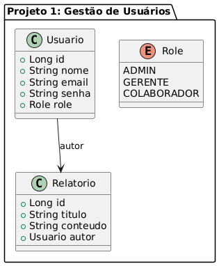
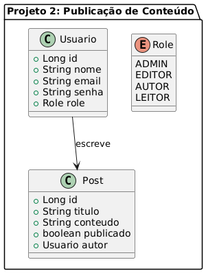
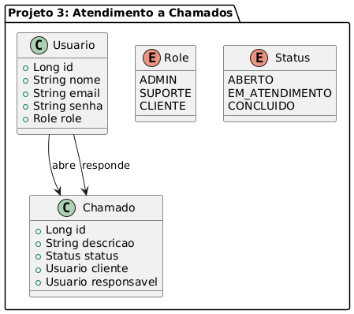

# Projeto Base — API com Spring Boot + JWT

Este é o repositório base para o segundo projeto do curso de Java com Spring Boot.

## Funcionalidades

- Autenticação com JWT
- Controle de acesso por perfis (roles)
- Criptografia de senhas com BCrypt
- Cadastro e login de usuários
- Estrutura de DTOs, services, controllers e repositórios

## Requisitos

- Java 17
- Maven
- Docker (PostgreSQL + Pgadmin)

## Setup

1. Clone o repositório
2. Rode o banco com:
```bash  
docker compose up -d
```
3. Rode o projeto com:
```bash  
./mvnw spring-boot:run
```
---  
## Sugestões de Aplicações com Controle de Acesso

Este repositório pode servir como base para diversos projetos que envolvem controle de acesso baseado em papéis. Algumas ideias:

1. **Sistema de Gestão de Usuários e Relatórios**
   - Roles: ADMIN, GERENTE, COLABORADOR
   - Permissões: visualizar, editar, controlar acesso a relatórios
   - UML:
   - 
  ---
2. **Plataforma de Publicação de Conteúdo**
   - Roles: ADMIN, EDITOR, AUTOR, LEITOR
   - Permissões: criar, revisar, moderar e visualizar posts
   - UML:
   - 
  ---
3. **Sistema de Atendimento a Chamados**
   - Roles: ADMIN, SUPORTE, CLIENTE
   - Permissões: criar chamados, atualizar status, responder
   - UML:
   - 
---
4. **Sistema de Controle de Estoque**
   - Roles: ADMIN, ALMOXARIFE, VISUALIZADOR
   - Permissões: cadastrar produtos, movimentar estoque, consultar
   - UML:
   - 

Cada projeto pode usar este template e adaptá-lo conforme a regra de negócio desejada.

---
# Regras:
## Grupos:
- Pode ser realizado individualmente, dupla ou trio.
- Os grupos serão definidos no Google Classroom

## Entrega:
- Repositório no Github (Fork deste Repositório atual)
- Commits seguindo [este padrão](https://github.com/iuricode/padroes-de-commits)
- Apresentação do projeto no dia 18/09/2025